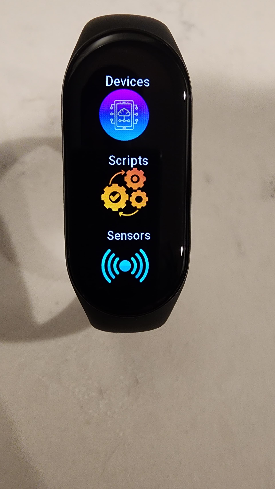

# Home Assistant companion for Zepp OS devices
Application that allows you to control a smart home based on the Home Assistant

   

## Features
- Categories
- Toggle switch
- Toggle light, see its effect (if presented), change its brightness (if this possible)
- Media player support with play/pause, prev/next, volume control
- Script support
- sensor info
  

### Devices supported
- Mi Band 7 (You need modified Zepp app (see preparations))
- All other Zepp OS devices, but there is no proper UI for them

### Preparations
#### Mi Band 7
- [Modified Zepp App](https://drive.google.com/file/d/1wx6Er1J462q55uaTOTWeS-IoBWQpkCrD/view?usp=drivesdk)
- You need to connect Mi Band 7 to Modified Zepp App the same way you would with Zepp Life (google auth is not  supported)
- You need to enable [Developer Mode](https://docs.zepp.com/docs/1.0/guides/tools/zepp-app/) in app
- Install app by building on device
- Open the application settings and specify the addresses of Home Assistant, Long-lived access token and select the sensors you want to display on Zepp OS device
#### Home Assistant
- Long-lived access token (you can generate it on your-ha-instance.local/profile page)
- "If you are not using the [`frontend`](https://www.home-assistant.io/integrations/frontend/) in your setup then you need to add the [`api` integration](https://www.home-assistant.io/integrations/api/) to your `configuration.yaml` file."
